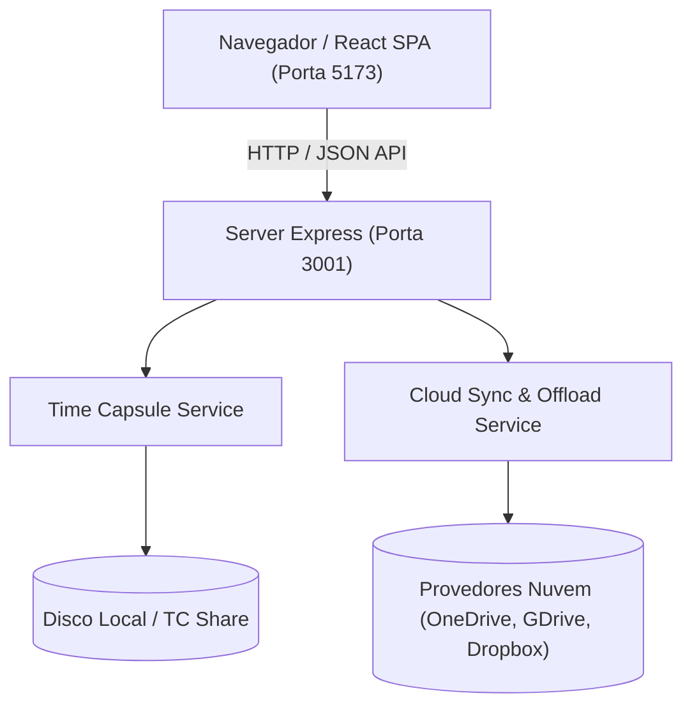

# 🏛️ Arquitetura e Índice do Repositório (ARCHITECTURE.md)

Este documento fornece um índice detalhado da estrutura do código, componentes, rotas de API e fluxo de dados do **Gerenciador Time Capsule (gerenciador_tc)** para auxiliar ferramentas de análise estática, indexadores e desenvolvedores.

---

## 📐 Visão Geral do Sistema

O sistema é uma aplicação full-stack composta por um **Frontend React SPA** (empacotado via Vite) e um **Backend Node.js / Express**.

---

## 📂 Índice de Arquivos e Módulos

### 1. Frontend (`src/`)

- [src/main.jsx](file:///C:/projetos/gerenciador_tc/src/main.jsx): Ponto de entrada do React DOM.
- [src/App.jsx](file:///C:/projetos/gerenciador_tc/src/App.jsx): Componente principal e gerenciador de estado global (Status, Arquivos, Jobs, Regras, Modais).
- [src/index.css](file:///C:/projetos/gerenciador_tc/src/index.css): Sistema de design com variáveis CSS, efeito glassmorphism e responsividade.
- [src/App.css](file:///C:/projetos/gerenciador_tc/src/App.css): Estilos complementares de layout.

#### Componentes UI (`src/components/`):
- [Header.jsx](file:///C:/projetos/gerenciador_tc/src/components/Header.jsx): Barra superior com marca, status de conexão e atalhos para configurações.
- [DiskMeterCard.jsx](file:///C:/projetos/gerenciador_tc/src/components/DiskMeterCard.jsx): Medidor de uso de disco (local e nuvem) com barra de progresso e alertas.
- [FileBrowser.jsx](file:///C:/projetos/gerenciador_tc/src/components/FileBrowser.jsx): Navegador em duas colunas para comparar e manipular arquivos do Time Capsule e Nuvem.
- [JobMonitor.jsx](file:///C:/projetos/gerenciador_tc/src/components/JobMonitor.jsx): Painel de acompanhamento de tarefas ativas de descarregamento (*offload*) e cópia.
- [TCConfigModal.jsx](file:///C:/projetos/gerenciador_tc/src/components/TCConfigModal.jsx): Modal para alteração do IP, compartilhamento e teste de conexão com Time Capsule.
- [AutoRulesModal.jsx](file:///C:/projetos/gerenciador_tc/src/components/AutoRulesModal.jsx): Modal para gerenciamento e criação de regras de limpeza e sincronização automática.
- [FileEditorModal.jsx](file:///C:/projetos/gerenciador_tc/src/components/FileEditorModal.jsx): Editor e visualizador de conteúdo dos arquivos armazenados.
- [NewItemModal.jsx](file:///C:/projetos/gerenciador_tc/src/components/NewItemModal.jsx): Modal para criação de novos arquivos ou pastas no Time Capsule.

---

### 2. Backend (`server/`)

- [server/index.js](file:///C:/projetos/gerenciador_tc/server/index.js): Servidor Express rodando na porta `3001`, definindo endpoints REST.
- [server/services/timeCapsuleService.js](file:///C:/projetos/gerenciador_tc/server/services/timeCapsuleService.js): Serviço de gerenciamento do sistema de arquivos e status do Time Capsule.
- [server/services/cloudSyncService.js](file:///C:/projetos/gerenciador_tc/server/services/cloudSyncService.js): Serviço de simulação e execução de Jobs de Offload e gerenciamento de provedores de nuvem.

---

## 🌐 Especificação das APIs REST (`/api/`)

| Endpoint | Método | Descrição | Módulo Responsável |
| :--- | :--- | :--- | :--- |
| `/api/status` | `GET` | Retorna o status da conexão, saúde do disco e provedores. | `server/index.js` |
| `/api/timecapsule/files` | `GET` | Lista arquivos do Time Capsule dado um parâmetro `path`. | `timeCapsuleService.js` |
| `/api/timecapsule/file-details/:id` | `GET` | Retorna detalhes e conteúdo de um arquivo específico. | `timeCapsuleService.js` |
| `/api/timecapsule/save-file` | `POST` | Atualiza o conteúdo de um arquivo existente. | `timeCapsuleService.js` |
| `/api/timecapsule/create-item` | `POST` | Cria um novo arquivo ou pasta. | `timeCapsuleService.js` |
| `/api/timecapsule/delete-item/:id` | `DELETE` | Remove um item do sistema de arquivos do Time Capsule. | `timeCapsuleService.js` |
| `/api/timecapsule/test-connection` | `POST` | Testa e simula conexão SMB com IP e credenciais do TC. | `timeCapsuleService.js` |
| `/api/cloud/files` | `GET` | Lista arquivos do provedor de nuvem selecionado (`provider`, `path`). | `cloudSyncService.js` |
| `/api/jobs` | `GET` | Retorna a lista de tarefas de transferência/offload ativas. | `cloudSyncService.js` |
| `/api/jobs/start-offload` | `POST` | Inicia um novo job de offload ou cópia de arquivos para a nuvem. | `cloudSyncService.js` |
| `/api/jobs/cancel/:jobId` | `POST` | Cancela uma tarefa em andamento. | `cloudSyncService.js` |
| `/api/rules` | `GET` / `POST` | Obtém ou cria regras automatizadas de descarregamento. | `cloudSyncService.js` |

---

## 🛠️ Tecnologias e Dependências

- **Runtime**: Node.js v18+
- **Frontend**: React 19, Vite, Lucide React (Ícones)
- **Backend**: Express, CORS, Dotenv
- **Linter**: Oxlint
